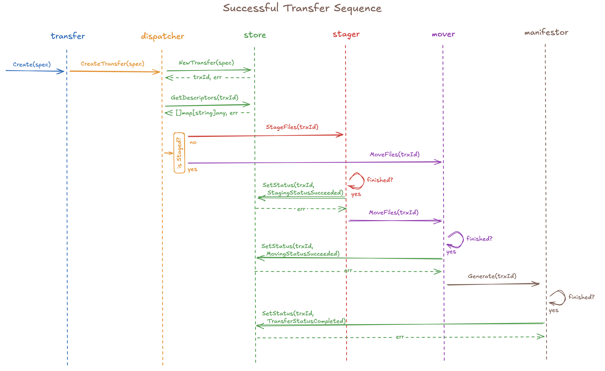

# DTS Transfer Orchestration

The `transfer` package implements the orchestration logic that DTS uses to perform file transfers.
It consists of a family of concurrent sequential programs, each implemented by a singleton struct
backed by a goroutine:

* The **dispatcher** accepts transfer-related requests from "clients" (properly-routed requests
  from the web service layer) and dispatching them to other programs.
* The **store** maintains the state of transfer records, allowing other programs to fetch transfer
  metadata and manipulate status information.
* The **stager** handles file staging operations, initiating file transfers via the **mover** on
  success.
* The **mover** handles the transfer of the file payloads, initiating the generation and transfer of
  manifests via the **manifestor** on success.
* The **manifestor** generates metadata (JSON) manifests for completed transfers, moving each into
  place with the rest of its payload.

Here's a sequence diagram illustrating what happens when everything goes right:

More detailed documentation is available in the source files for these programs.
